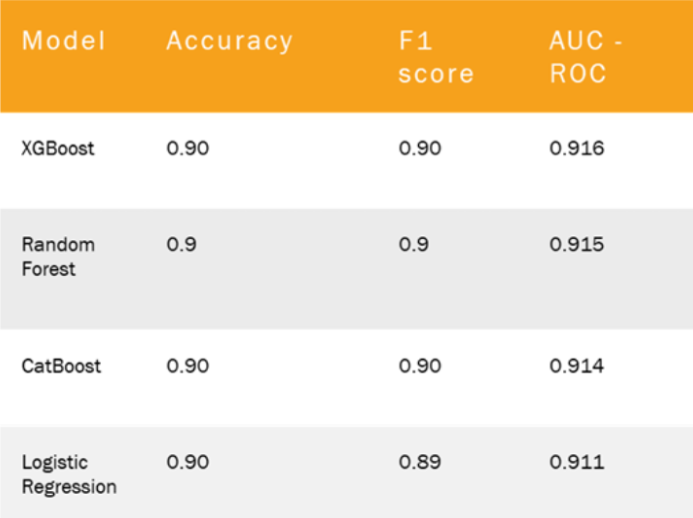

# 💳 Credit or Regret?
> Predicting Loan Defaults at Scale Using LendingClub Data + Machine Learning

A full-stack machine learning project that classifies loan default risk using 13.9M LendingClub records. Built and scaled with Google Cloud tools including BigQuery and Vertex AI.

---

## Problem Statement
Loan defaults represent a significant risk for financial institutions. Our goal was to develop models that flag high-risk borrowers before loans are issued, using structured data (FICO scores, income, term, etc.).

---

## Tech Stack
- **📦 Data**: LendingClub (Accepted + Rejected Loans)
- **🧠 Models**: Logistic Regression, Random Forest, XGBoost, CatBoost
- **☁️ Tools**: Google BigQuery, Vertex AI Workbench, pandas, scikit-learn

---

### 📊 Model Performance Summary

Here’s a summary of the best-performing models:

> 📌 Logistic Regression performed surprisingly well, rivaling tree-based models thanks to clean linear features like FICO and loan grade.

---

## 🧪 Project Structure

📂 credit-or-regret  
├── 📁 notebook  
│   └── 📄 [Final_Notebook_V3.ipynb](https://github.com/DhaivatN/credit-or-regret/blob/main/notebook/Final_Notebook_V3.ipynb)  
├── 📁 report  
│   └── 📄 [Final_Report.pdf](https://github.com/DhaivatN/credit-or-regret/blob/main/report/Final_Report.pdf)  
├── 📁 presentation  
│   └── 📄 [Loan_Default_Prediction.pptx](https://github.com/DhaivatN/credit-or-regret/blob/main/Loan_Default_Prediction.pptx)  
├── 📁 src  
│   └── 📄 [preprocessing_clean.ipynb](https://github.com/DhaivatN/credit-or-regret/blob/main/src/preprocessing_clean.ipynb)  
├── 📁 data  
│   └── 🔗 [LendingClub Dataset (Kaggle)](https://www.kaggle.com/datasets/wordsforthewise/lending-club)  
└── 📄 [README.md](https://github.com/DhaivatN/credit-or-regret/blob/main/README.md)

---

## 📁 Dataset

Due to file size, data is not stored here. You can access both **accepted** and **rejected** loan files from Kaggle:

🔗 [LendingClub Dataset on Kaggle](https://www.kaggle.com/datasets/wordsforthewise/lending-club)

---

## 🧠 Learnings + Insights

- Tree-based models handled non-linear features like employment better
- Logistic Regression thrived due to clean, interpretable features
- `policy_code` flagged potential information leakage
- Rejected loan data required heavy preprocessing, but adds valuable context

---

## 🔭 Future Work

- Integrate SHAP for interpretability
- Explore semi-supervised learning on rejected loans
- Use temporal validation splits for real-world drift

---

## 📄 License

This project is licensed under the MIT License - see the [LICENSE](LICENSE) file for details.

